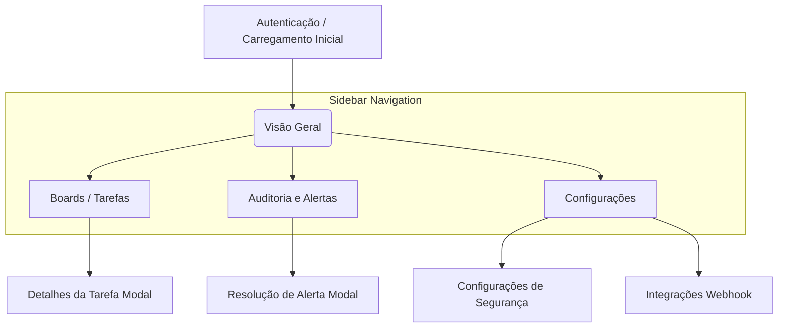

# Arquitetura do Dashboard Web do GovernAI

Este documento descreve a arquitetura visual e o fluxo de navegação planejados para o Dashboard Web do GovernAI. A interface tem como objetivo permitir o acompanhamento de métricas, tarefas, e o gerenciamento de permissões e alertas de forma visual, centralizando a governança dos agentes autônomos.

## 1. Arquitetura da Interface (Telas Principais)

O escopo de gestão visual do framework será coberto pelas seguintes telas principais:

### 1.1. Visão Geral (Home / Overview)
- Resumo de métricas globais (ex: total de LLM calls, tarefas concluídas, tempo médio por tarefa).
- Gráfico de tendências de alertas e bloqueios.
- Lista consolidada das tarefas atualmente em andamento.

### 1.2. Kanban de Tarefas (Boards)
- Visão visual no estilo Trello/GitHub Projects, integrada diretamente com o arquivo `TASKS.md` local.
- Colunas esperadas: Backlog, Pending, In Progress, Blocked e Done.
- Cartões das tarefas contendo tags de categoria, tempo decorrido e avatares (indicadores de agentes).

### 1.3. Auditoria e Logs (Audit Trail)
- Visualizador interativo do arquivo `audit.log` com suporte a filtros avançados.
- Possibilidade de filtrar por nível de segurança, agente responsável e tipo de ação.
- Alertas críticos de governança em destaque.

### 1.4. Configurações de Governança (Settings)
- Formulários visuais para editar as políticas no arquivo `governai.config.json` e credenciais no `.env`.
- Gestão centralizada de permissões (arquivos e bash).
- Painel para configuração do webhook do GitHub e adaptações do Notifier (Slack, Discord, SMTP).

---

## 2. Fluxo de Navegação

O sistema adotará uma arquitetura de menu lateral fixo (Sidebar) para facilitar o trânsito entre as visões de alto nível.

---

## 3. Estética de Design (UI/UX)

Para refletir a natureza tecnológica e focada em inteligência artificial do GovernAI, o dashboard deve adotar uma estética premium:
- **Tema:** Escuro (Dark Mode) por padrão, com elementos que remetem ao design Cyberpunk ou Minimalista Futurista.
- **Cores:** Fundo predominantemente escuro (ex: `#0f172a`), tipografia moderna (como Inter ou Outfit), com sotaques em neon ou ciano para destacar métricas ativas e vermelho vivo/alaranjado para alertas de segurança e bloqueios de governança.
- **Interações:** Uso de micro-interações, transições suaves entre páginas e efeitos modernos como glassmorphism (efeito vidro desfocado) nos cartões do Kanban e modais.
