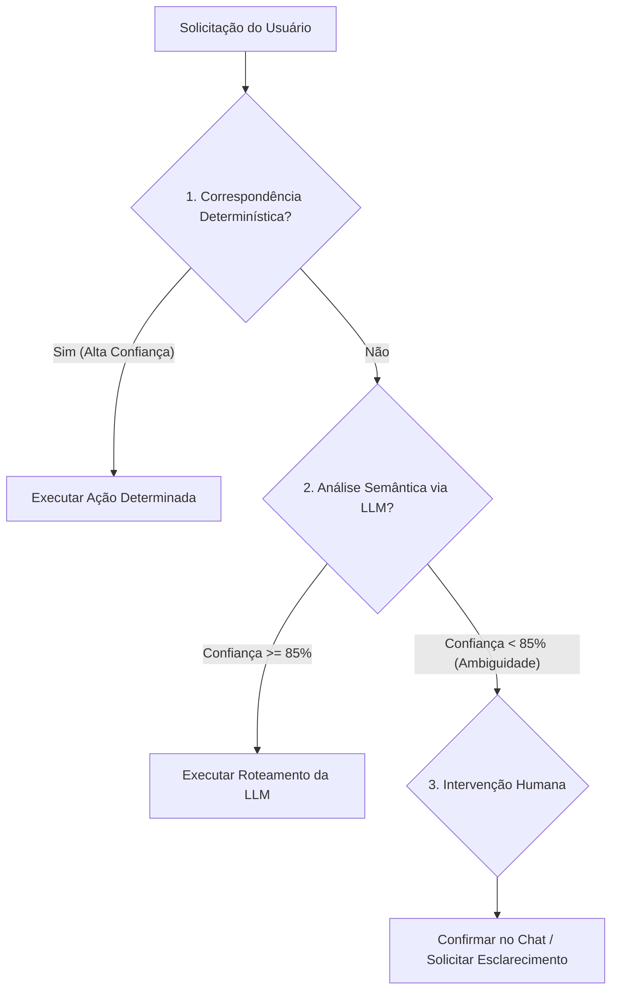

# 🧠 Camada de Decisão do GovernAI

A **Camada de Decisão** é o núcleo de inteligência e governança do GovernAI. Ela processa as solicitações do usuário (linguagem natural, comandos, relatos) e as roteia automaticamente para a ação apropriada no ciclo de vida do desenvolvimento assistido por agentes de IA.

---

## 🎯 Objetivo

Eliminar o caos na execução de agentes, garantindo que:
1. **Nenhum código seja alterado** sem uma tarefa formalmente aprovada no backlog.
2. **Comandos informativos ou investigativos** sejam respondidos rapidamente e sem burocracia.
3. **Impedimentos técnicos** (como erros de compilação ou falta de permissões) bloqueiem imediatamente o andamento da tarefa no board, acionando o suporte humano.

---

## 🚦 Ordem de Prioridade na Classificação

O GovernAI opera em uma cadeia sequencial de prioridade de decisão para otimizar custo, latência e confiabilidade:

1. **Camada 1: Determinístico (Prioridade 1):** Utiliza analisadores sintáticos e expressões regulares (RegEx) rápidos e de custo zero para classificar comandos e prefixos óbvios.
2. **Camada 2: Inteligente - LLM (Prioridade 2):** Fallback semântico acionado quando a intenção não é expressa de forma padronizada. Avalia a frase de forma inteligente.
3. **Camada 3: Humano (Prioridade 3):** Acionado em caso de baixa confiança na classificação da LLM ou ambiguidade estrutural, bloqueando ações automatizadas incorretas.

---

## 📊 Matriz de Decisão e Roteamento

| Solicitação Típica | Intenção Classificada | Ação de Governança | Regra Determinística | Lógica da LLM (Fallback) |
| :--- | :--- | :--- | :--- | :--- |
| `"criar task: implementar login"` | Criação de Task | Registrar no backlog local (`TASKS.md`) e sincronizar com o board do GitHub. | Prefixo `criar task:` ou `adicionar task:` (case-insensitive) | Interpretação de frases de desejo como "seria bom adicionar o recurso X no projeto". |
| `"executar TASK-001"` | Execução de Task | Mudar status para `[/]` (In Progress), gerar o plano de ação e aguardar aprovação. | Padrão `executar (TASK-\d+)` | Associação semântica: "vamos começar a programar a tarefa de login". |
| `"git status"`, `"run tests"`, `"explain code"` | Execução Direta | Propor e executar comandos de leitura, informativos ou diagnósticos. | Padrão de comandos CLI conhecidos (`git`, `ls`, `grep`, `npm`, `python`) ou perguntas gerais. | Dúvidas teóricas ou requisição de formatação que não envolvem alterações no código-fonte. |
| `"Encontrei um erro de permissão no script"` | Bloqueio / Impedimento | Mover a tarefa atual para `Blocked` no board e documentar o motivo. | Ocorrência de erro fatal em comandos (exit code != 0), string de erro de rate limit (`429`) ou "permissão negada". | Detecção de reclamações do usuário ou do próprio console do agente sobre falhas intransponíveis. |

---

## 🛠️ Regras Determinísticas (Regex & Gatilhos)

A primeira barreira de classificação avalia strings contra os seguintes padrões regex estruturados:

- **Criação de Task:**
  - `^(criar\s+task|nova\s+task|adicionar\s+task|new\s+task)\s*:\s*(.+)$` (Ex: `criar task: configurar rotas`)
- **Execução de Task:**
  - `^(executar|iniciar|rodar|start)\s*(TASK-\d+)$` (Ex: `executar TASK-002`)
- **Bloqueio Automático por Erro:**
  - Interpolação de erros do console: `Permission denied`, `API key invalid`, `429 Too Many Requests`, `dailyLimitExceeded`, `fatal: not a git repository`.

---

## 🔒 Fallback Seguro e Níveis de Confiança (Confidence Score)

Ao recorrer à classificação inteligente baseada em LLM (Camada 2), o agente avalia o **nível de confiança** da inferência semântica:

1. **Confiança Alta (>= 85%):** Roteamento automático imediato (Ex: inferir que "implemente o endpoint de cadastro" significa criar e executar uma tarefa).
2. **Confiança Baixa (< 85%):** Fallback seguro. O agente **bloqueia** qualquer alteração de código ou criação automática e questiona o usuário no chat:
   > *"Entendi que você deseja alterar a lógica de autenticação. Deseja criar uma nova tarefa em `TASKS.md` para isso ou executar o comando diretamente?"*
   > **[Criar Task]** | **[Execução Direta]** | **[Cancelar]**

---

## 🛑 Critérios de Bloqueio (Blockers/Impedimentos)

Uma tarefa em andamento (`In Progress`) é colocada imediatamente no status **`Blocked`** (Bloqueada) no GitHub Projects quando qualquer um dos seguintes critérios é atendido:

1. **Erros de Dependência ou Sistema:** Falha em ferramentas externas (ex: banco de dados offline, falta de internet).
2. **Erros de Credenciais/Permissões:** Falha de autenticação com serviços ou permissão negada no sistema de arquivos local.
3. **Excesso de Limite (Rate Limit):** Retorno de erros de cota do Gemini (`429 RESOURCE_EXHAUSTED` ou `dailyLimitExceeded`).
4. **Ambiguidade de Requisitos:** O agente encontra contradições no `GEMINI.md` ou na descrição da task que impedem o andamento seguro do desenvolvimento.
