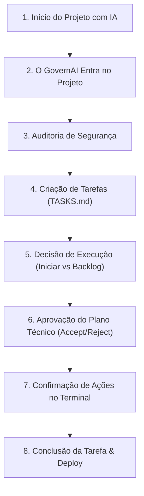

# Guia Completo do Fluxo de Trabalho do GovernAI

Este documento explica, de ponta a ponta e em linguagem simples, todo o ciclo de vida de um projeto que utiliza o **GovernAI**. Você entenderá como o framework acompanha, protege e audita cada passo do desenvolvimento, mantendo você no controle absoluto do seu sistema.

---

## Sumário do Fluxo

---

### 1. Início do Projeto com IA
Tudo começa quando você decide criar um sistema (um site de agendamentos, um robô de WhatsApp, etc.) utilizando um assistente de inteligência artificial (IA). Você abre o chat do assistente e pede que ele crie a estrutura do projeto.
*   **Problema:** Sem controle, a IA pode começar a programar de forma caótica, instalando arquivos no lugar errado ou bagunçando códigos que já funcionavam.

### 2. Como o GovernAI entra no projeto
Assim que a pasta do projeto é criada na sua máquina, o **GovernAI** é ativado. Ele cria um arquivo de regras centralizado chamado `governai.config.json`.
*   **O que ele faz:** Esse arquivo diz à IA quais são as regras de conduta estritas do seu projeto (por exemplo: *"Sempre peça permissão para o usuário antes de mudar arquivos"* ou *"Nunca envie dados confidenciais para a internet"*). Se a IA tentar ignorar essas regras, o GovernAI bloqueia o avanço.

### 3. Como ele audita o projeto
Antes de permitir qualquer alteração no código, o GovernAI realiza uma varredura completa da pasta. Ele examina a estrutura local e confere se a "infraestrutura de segurança" básica existe:
*   **Git (Controle de Versão):** Garante que o projeto tenha um histórico de "fotos" anteriores. Se a IA cometer um erro, podemos facilmente voltar no tempo para a última versão que estava funcionando.
*   **Arquivo .gitignore:** Garante que chaves confidenciais ou senhas nunca sejam comitadas na internet.
*   **Painel de Tarefas local (TASKS.md):** Garante que haja um painel de controle listando as tarefas planejadas.

### 4. Como funciona a criação de tarefas
Qualquer nova funcionalidade a ser criada (ex: *"Criar tela de preços"*) deve ser cadastrada como uma tarefa no arquivo local [TASKS.md](file:///home/mark/Dev/governai/TASKS.md) no status de pendente (`[ ]`).
*   **Sincronização Automática:** Sempre que uma tarefa é adicionada localmente, o GovernAI sincroniza em tempo real com o painel visual remoto (GitHub Projects), garantindo consistência total.

### 5. Como funciona a decisão (Executar ou Backlog)
Quando uma nova tarefa entra em andamento, o GovernAI intercepta a execução e abre uma tela de decisão interativa no terminal, exibindo duas opções explicativas:
1.  **Começar a trabalhar nela agora:** O GovernAI muda o status no painel para ativo (`[/]`), inicializa o cronômetro de trabalho e acompanha o tempo de execução.
2.  **Apenas planejar para depois:** Mantém a tarefa em espera (`[ ]`) na lista de tarefas futuras para segurança do fluxo.

### 6. Como funciona a aprovação de Planos de Trabalho
Antes de programar de fato, a IA deve detalhar como fará a alteração em um **Plano Técnico de Trabalho** (`implementation_plan.md`). O GovernAI intercepta essa etapa e exibe no chat do usuário um bloco de orientação amigável contendo:
*   O resumo simplificado do impacto real da alteração.
*   Links diretos para que o usuário revise o Plano Técnico de Trabalho e o Checklist de Execução na barra de arquivos à direita.
*   **Botões de Ação:** O usuário lê as explicações e escolhe **Accept** (para permitir que a IA altere o código) ou **Reject** (para pausar a tarefa e pedir ajustes).

### 7. Como funciona a confirmação de ações no terminal
Durante a execução de tarefas, a IA pode precisar rodar comandos interativos (ex: enviar uma opção, preencher dados, instalar pacotes). 
*   **Segurança no Executor:** O GovernAI impede o envio de dados silenciosos. Antes de realizar qualquer input no terminal, o framework exibe um aviso claro de **Confirmação de Ação** mostrando o valor exato a ser enviado (ex: "1"), o motivo técnico e o impacto daquela ação na prática. O comando só executa após o usuário autorizar explicitamente.

### 8. Como o projeto evolui até o deploy
A IA programa a tarefa seguindo o plano aprovado. O GovernAI monitora o progresso ativamente:
1.  **Validação Local:** A IA realiza testes simulados e valida se a alteração atende aos critérios de aceite da tarefa.
2.  **Registro de Métricas:** A CLI do GovernAI salva no arquivo `metrics.json` o tempo levado, commits realizados, alertas acionados (ex: se a IA demorar muito) e passos de LLM consumidos.
3.  **Fechamento Seguro:** Ao finalizar, o status da tarefa é atualizado para concluído (`[x]`). O sincronizador move automaticamente o card para a coluna **Done** no painel de controle remoto.
4.  **Deploy e Histórico:** O progresso final é registrado em um Relatório de Resultados (`walkthrough.md`) e comitado de forma segura no Git. O código agora está pronto para ir ao servidor de produção (deploy) de forma rastreável, auditada e 100% segura.

---

## ➡️ Resultado: o projeto continua organizado, seguro e sob controle.
